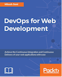

```
Roberto Nogueira  
BSd EE, MSd CE
Solution Integrator Experienced - Certified by Ericsson
```
# eBook DevOps for Web Development



**About**

Learn everything you need to about the subject of this `eBook` project.

[Homepage](https://ebook.com)

## Topics
```
Table of Contents
[x] Preface
[x] 1: GETTING STARTED – DEVOPS CONCEPTS, TOOLS, AND TECHNOLOGIES
[~] 2: CONTINUOUS INTEGRATION WITH JENKINS 2 utpto
       => Sending e-mail notifications based on build status.
[ ] 3: BUILDING THE CODE AND CONFIGURING THE BUILD PIPELINE
[ ] 4: INSTALLING AND CONFIGURING CHEF
[ ] 5: INSTALLING AND CONFIGURING DOCKER
[ ] 6: CLOUD PROVISIONING AND CONFIGURATION MANAGEMENT WITH CHEF
[ ] 7: DEPLOYING APPLICATION IN AWS, AZURE, AND DOCKER
[ ] 8: MONITORING INFRASTRUCTURE AND APPLICATIONS
[ ] 9: ORCHESTRATING APPLICATION DEPLOYMENT
```
